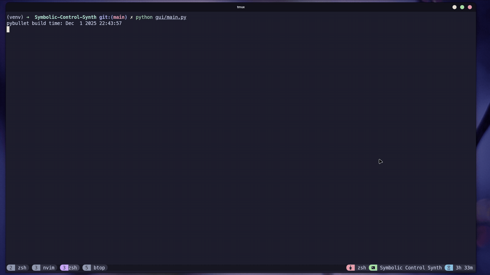

# Symbolic Controller Synthesizer

A high-performance tool for synthesizing correct-by-construction controllers for nonlinear dynamical systems. This project leverages **GPU acceleration** and **runtime compilation** to generalize symbolic control to any model in any dimension, overcoming the computational bottlenecks of traditional methods.


## Table of Contents

- [Overview](#overview)
- [Features](#features)
- [Synthesis Pipeline](#synthesis-pipeline)
- [Build Instructions](#build-instructions)
- [Team](#team)


## Overview

<div align="center">
    <table>
        <tr>
            <td></td>
        </tr>
    </table>
</div>

Traditional symbolic control is often restricted to specific, low-dimensional models. This project overcomes that barrier by **generalizing** to support arbitrary models and dimensions, **accelerating** the synthesis pipeline, and **automating** the complex mathematical analysis.
> [!NOTE]
> This project is built upon the theoretical framework presented in [this paper](https://www.techniques-ingenieur.fr/base-documentaire/automatique-robotique-th16/ingenierie-systeme-42717210/approches-symboliques-pour-le-controle-des-systemes-non-lineaires-s7467/).


## Features
- **Model Agnostic:** Works with any system dynamics defined by symbolic expressions; no hardcoded models.
- **GPU Acceleration:** Parallelizes the construction of the symbolic abstraction (millions of state transitions) using CUDA kernels.
- **Just-In-Time Compilation:** Automatically converts user-defined mathematical expressions into optimized CUDA code at runtime.
- **Smart Analysis:** Automatically detects system "cooperativity" to choose the most efficient image computation method (Corner Evaluation vs. GPU Gradient Descent).
- **Optimized Backend:** High-performance C++ solver using fixed-point algorithms for fast controller synthesis.
- **Interactive GUI:** Visualizes state space and trajectories in real-time, with support for saving and loading configurations via JSON.


## Synthesis Pipeline

The execution flow processes raw user input into a verified controller through five stages:

1.  **User Input**
    - Input raw mathematical expressions for system dynamics.
2.  **Cooperativity Analysis**
    - Computes Symbolic Jacobian.
    - Determines if the system is monotone (cooperative).
    - Selects the optimal computation strategy.
3.  **Automaton Construction (GPU)**
    - **Discretization:** Maps continuous state space to discrete cells.
    - **Parallel Execution:** Each GPU thread computes transitions for a single cell.
    - **Runtime Injection:** Compiles custom CUDA kernels for the specific dynamical model.
4.  **Controller Synthesis**
    - Solves the safety/reachability game using optimized C++ fixed-point algorithms.
5.  **Output & Visualization**
    - Renders the resulting controller and simulates trajectories in the GUI.


## Build Instructions

### Prerequisites
*   **Python 3**
*   **CUDA Toolkit** 
*   **C++17 Compiler**
*   **CMake**

### Installation

1.  **Clone the repository with submodules**
    ```bash
    git clone --recurse-submodules https://github.com/MouadHaikal/Symbolic-Control-Synth
    cd Symbolic-Control-Synth
    ```

2.  **Create and activate a Python virtual environment**
    ```bash
    python3 -m venv venv
    source venv/bin/activate
    ```

3.  **Install dependencies in editable mode**
    ```bash
    pip install -e .
    ```

4.  **Build the project**
    ```bash
    chmod +x build.sh
    ./build.sh
    ```

5.  **Run the GUI**
    ```bash
    python3 gui/main.py
    ```


## Team

This project was developed by:

- [Aya Igadern](https://github.com/ayaigadern)
- [Ahmed Yassine Ibhi](https://github.com/ibhiyassine)
- [Yasser Talty](https://github.com/YasserTalty)
- [Mouad Haikal](https://github.com/MouadHaikal)

*Defended on the 2nd of December, 2025*
